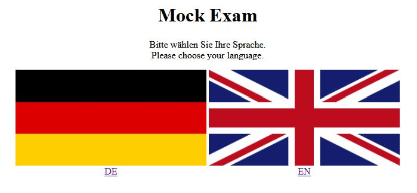
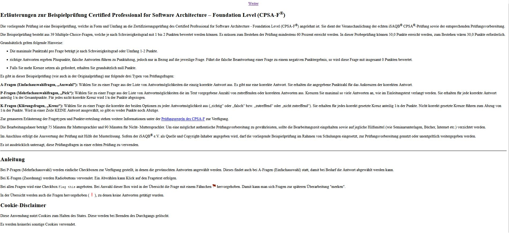
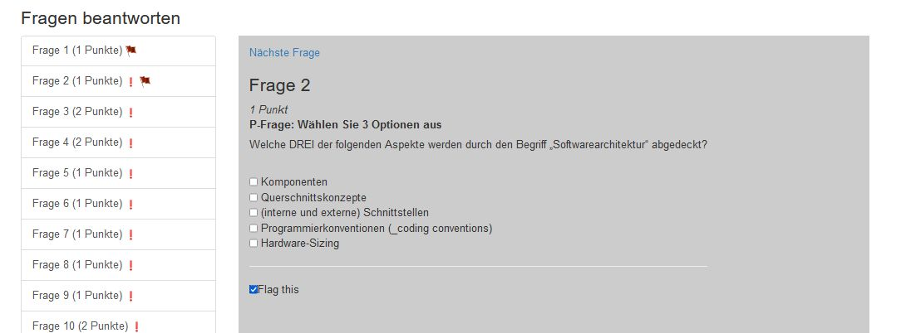
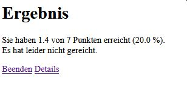
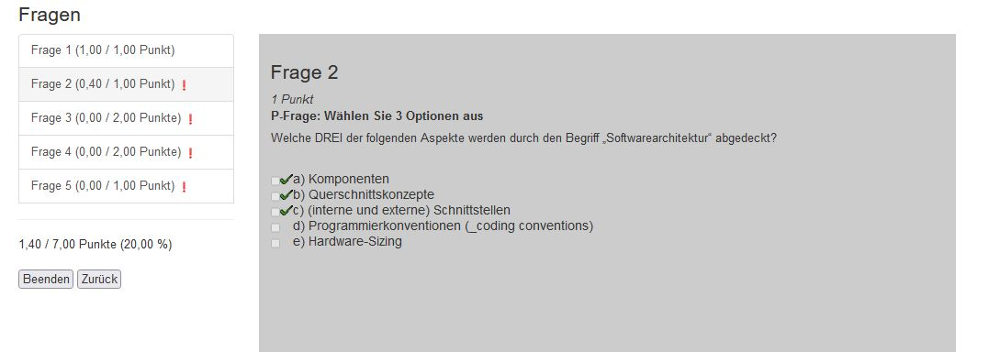
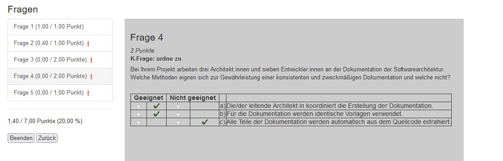

//tag::DE
== Foundation Level Mock-Examen wird interaktiv

Dank dreier Fügungen wird das Foundation Level Mock-Examen nun interaktiv.

Als Backend-Entwickler bekam ich von unseren Enterprise Architekten die Vorgabe, 
dass zukünftige Entwicklungen auf https://spring.io/projects/spring-boo[SpringBoot] basieren sollen.
So brauchte ich etwas halbwegs Sinnvolles, um mich in diese Materie einzuarbeiten.

Für unseren Bereich wurde ich in Rolle eines Architekten berufen - der gängige Weg eines Senior-Entwicklers ;-)
Da ich bereits zuvor viel auch in dieser Richtung durch Podcasts und Artikel gelernt hatte, wusste ich, dass ich noch einiges mehr zu lernen hatte.
So habe ich nach passenden Schulungen gesucht und beim iSAQB fündig geworden. +
Während ich die Schulungen von meinem Arbeitgeber finanziert bekam, galt dies nicht für das Examen.
Das wollte ich mir dann selber gönnen.
Jedoch - ein wenig Bammel hatte ich schon. 
So war ich froh, mal eine inhaltlich gleichwertige Prüfung zur Probe absolvieren zu können.
Also: 

 * Fragen ausdrucken, 
 * ankreuzen, 
 * Lösung ausdrucken, 
 * Antworten mit Fragen vergleichen, 
 * Punkte ausrechnen und
 * prüfen, ob bestanden wurde.
 
So viele manuelle Schritte!   

Die dritte Fügung war, dass der iSAQB das Mockexamen auf https://www.asciidoc.org[AsciiDoc] 
https://www.isaqb.org/de/blog/migrating-the-isaqb-mock-examination-to-asciidoc/[umgestellt] hat.
Im Gegensatz zu PDF oder Word ist AsciiDoc ein reines Textformat.
Und für einen Programmierer bedeutet dies: Man kann einen Parser schreiben!

So kam ich auf die Idee, eine Webanwendung auf Basis von SpringBoot zu schreiben, bei der man das Mock-Examen interaktiv proben kann.
Kleine Anregungen kamen auch während meiner eigenen Foundation Prüfung.

=== Das Datenmodell

Ein Examen besteht aus mehreren Aufgaben, zu denen es mehrere Antwortmöglichkeiten gibt.
Die Texte sind mehrsprachig vorzusehen - für Deutsch und Englisch sind bereits Texte vorhanden.
Es gibt drei verschiedene Arten von Aufgaben:

* A-Fragen, bei denen eine aus mehreren Antworten ausgewählt werden muss,
* P-Fragen, bei denen mehrere aus der Antwortmenge ausgewählt werden müssen und
* K-Fragen, bei denen alle Antworten bewertet werden müssen. 

.Klassendiagramm
plantuml::overview-model.puml[]

=== Der Workflow

Wie gesagt, ich bin Backendentwickler und wollte ich keinen weiteren Frontend-Stack wie Angular aufnehmen.
HTML-Templating erschien mir einfacher und so kam ich zu https://www.thymeleaf.org/[Thymeleaf] - der Template-Engine, die auch 
in https://leanpub.com/hacking-with-springboot-23-reactive-edition[Hacking with Spring Boot 2.3: Reactive Edition],
dem Buch, mit dem ich mich etwas in SpringBoot eingearbeitet habe, verwendet wird.

Mit Papier und Bleistift ging es dann daran, Skizzen für die UIs zu machen.
Per Pfeilen miteinander verbunden, um den Ablauf zu definieren.
An die Skizze auch noch dran schreiben, welche Daten einzugeben oder anzuzeigen sind.
Dann noch die URLs für den Server.

.Ablauf
plantuml::overview-workflow.puml[]
 
 
=== Layout

Die Suche im Internet ergab für mich als Layout-Laie einen entsprechenden Startpunkt, so dass
ich ein akzeptables Layout erstellen konnte.

Die Seite mit der Sprachauswahl. Die Auswahl wird als Query-Parameter und ab dann als Cookie durchgereicht.

.index.html

Der Absolvent soll ja wissen, was erwartet wird. Also wird der Erläuterungstext angzeigt. Bezogen aus der entsprechenden ADOC-Datei von Github und direkt per AsciiDoc gerendert.
Darin habe ich auch die Kurzanweisung untergebracht (ich denke, die Anwendung ist grundsätzlich selbsterklärend, aber die Abwählmöglichkeit bei Radiobuttons ist hinzuprogrammiert).
Und nicht zu vergessen: der Cookie-Disclaimer.

.intro.html

Beim Ausfüllen des "Fragebogens" gibt es keine Überraschungen. 
Man kann über die seitliche Navigation zwischen den Fragen navigieren oder aber von Frage zu Frage gehen.
Zudem wird in der Navigation angezeigt, wiviele Punkte zu erreichen sind und ob man sich ein "Flag" gesetzt hat.

.process.html

Das Ergebnis ist kurz und knapp: Punkte und ob man bestanden hat.
(Mal sehen, ob ich das noch drin lasse...)

.result.html

Nach dem Absolvieren kann man sich seine Antworten mit den "Musterantworten" vergleichen lassen.
Das Layout ist an das Layout des Ausfüllens angelehnt.
In der Navigation wird angezeigt, wieviele Punkte möglich waren und wieviele man erreicht hat. 
Hat man Fehler gemacht, wird die jeweilige Frage markiert.
Je Frage wird angezeigt, welche Antworten man ausgewählt und welche erwartet wurden.

.details 1

Bei Fragen gilt dies auch, auch wenn die Darstellung etwas umständlicher per Tabelle erfordlich wurde.

.details 2

=== Veröffentlichen

Nachdem das Herumexperimentieren doch tatsächlich etwas Verwendbares zur Folge hatte,
war klar, dass ich das Projekt an den iSAQB stiften wollte. 
Damit dieser "überzeugt" werden kann, müssen natürlich die Sourcen offen sein.
Also zur Standardplattform GitHub und ein Repo öffentlich gemacht: https://github.com/janmaterne/isaqb-mock-exam-ui

=== Kontakt zur iSAQB

Wie es das Schicksal wollte, ist ein neuer Mitarbeiter bei uns iSAQB-Mitglied.
So konnte ich ihm das Programm mal vorstellen. Über ihn ging es dann weiter.
Dann kam parallel über eine Diskussion bei einem PR bei einem iSAQB-Repository
ein weiterer Kontakt zu stande.

Tenor: großes Interesse. Also mal sehen, wie es weiter geht.

=== Distribution 

Ein startbares JAR und testweise ein Dockerfile - mehr gab es nicht.
Doch es wurde der Wunsch nach einer "Distribution" geäußert.
So wurde die Automatisierung ausgebaut:

* das startbare JAR-File
* ZIP-Datei mit JDK und Startdatei für
  ** Windows
  ** MacOS
  ** Linux
* Docker Image

Das Docker Image auf https://hub.docker.com/r/janmaterne/mockexam[DockerHub] 
und den Rest bei https://github.com/janmaterne/isaqb-mock-exam-ui/releases[GitHub].

=== Ausblick

Na ja, das Übliche ...

* mehr Tests
* Refactoring
* Realisierung weiterer Anforderungen
* Umzug zur iSAQB
* Hosting einer laufenden Instanz
* ein Quiz-Modus für schnelle Wiederauffrischungsüberungen zwischendurch
* Anzeige der Erläuterungen auf der Ergebnisseite
* ...
//end:DE

//tag::EN
== Foundation Level Mock Exam becomes interactive

Thanks to three happenings the Foundation Level Mock Exam becomes interactive now.

As a backend developer I got the requirement by our enterprise architects that future development should base on https://spring.io/projects/spring-boo[SpringBoot].
So I needed something reasonable to dive into that.

In my project I became a software architect - nearly the standard for a senior developer ;-)
Because I learned much about that before by podcasts and articles, I knew that I already had to learn much more. 
So I searched for courses and found the iSAQB. +
While my company would pay the courses, they wont for the exam.
But I want to do it for my own.
But - I was nervous.
So I was happy to find an exam which I could try for free before.
So:

 * print out the questions
 * check the answers
 * print out the solution
 * compare the answers
 * calculate the score
 * check if passed.
 
So many manual steps!
 
The third influence was that the iSAQB changed their primary dataformat for the mock exam to https://www.asciidoc.org[AsciiDoc].
In contrast to PDF or Word AsciiDoc is just plain text.
And for a programmer that means: You could write a parser!

So I got the idea to write a web application with SpringBoot for interactive doing the exam.
Additionally I got some more ideas while doing my own foundation exam.  

== data model

An exam consists of many tasks whith each multiple answer options.
Texts should be multilingual - there are translations for German and English already.
There are three kinds of tasks:

* A-questions where you have to select one of many options,
* P-questions where you have to select multiple of many options and
* K-questions where you have to judge each option.

.class diagram
plantuml::overview-model.puml[]

=== workflow

As I said, I am a backend developer and I dont want to add a full frontend stack like Angular.
So simple html templating seemed to be a good decision and I came to https://www.thymeleaf.org/[Thymeleaf] - the template engine which was used in
https://leanpub.com/hacking-with-springboot-23-reactive-edition[Hacking with Spring Boot 2.3: Reactive Edition],
the book I used to dive into SpringBoot.

With pen and paper I started to draw wiremocks for the UI.
With arrows I connected them to define the workflow.
I added notes about the input data and data for visualization.
And the URLs for the backend.

.workflow
plantuml::overview-workflow.puml[]
 

=== layout

Research in the internet gave me a starting point so I could create an acceptable layout. 

The page with the selection of the language.
The selected language will be passed via query parameter to the backend and since then as cookie parameter.

.index.html

The user should know what to do. So the explanation text will be shown.
Loaded directly as ADOC from GitHub an rendered via AsciiDoctor.
I also added a short documentation (while I think the application is self explanationary, but the deselection of radio buttons is new).
I dont forget the cookie disclaimer.

.intro.html

While doing the form there arent any surprises.
You could use the navigation bar for switching between the questions.
And the nav bar shows how many points you could earn and if you set a "flag".

.process.html

The result is short: just the collected points and if you passed.
(Dont know if I leave that ...)

.result.html

After finishing you could see a comparison between your answers and the "solution".
The layout is like the layout while doing the exam.
The nav bar shows how many points you could earn and how many you earned.
If you missed some the question will be marked.
Per question your selection and the the "right" selection are shown.

.details 1

Same for questions with more complex possibilities.

.details 2

=== publishing

After a usable result I thought that I want to give the tool to the iSAQB.
To convince them I surely have to publish the sources.
So I went to the standard platform and created a repository:  https://github.com/janmaterne/isaqb-mock-exam-ui

=== contact

Life is funny. A new collegue of mine is iSAQB-member.
So I could show him the tool.
Additionally in a discussion on a PR in another repo I got another contact.

Result: big interest. So we'll see.

=== distribution

A startable JAR and for first tests a dockerfile - nothing more.
But a first wish was a "distribution".
So added a automatisation for that:

* the startable JAR
* ZIP file with JDK and launch script for
  ** Windows
  ** MacOS
  ** Linux
* docker image.

The docker image is on https://hub.docker.com/r/janmaterne/mockexam[DockerHub] 
and the rest on https://github.com/janmaterne/isaqb-mock-exam-ui/releases[GitHub].

=== future

Ok, the usual stuff ...

* more tests
* refactoring
* more requirements
* move to iSAQB
* hosting of the running instance
* a quiz mode for fast refreshment
* show the explantation texts on the detail result page
* ...
//end::EN