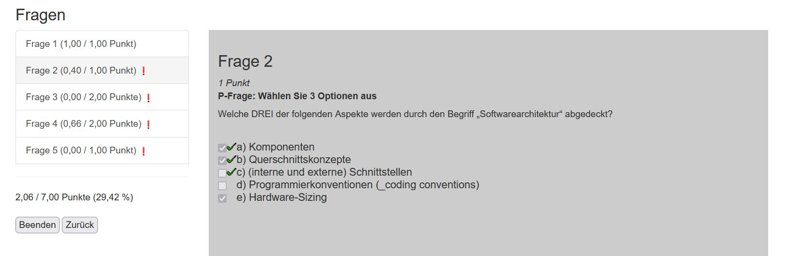
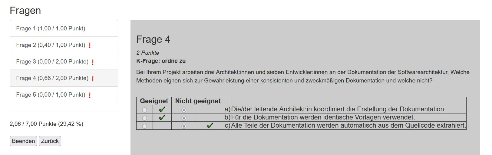

//tag::DE
== Foundation Level Mock-Examen wird interaktiv

Dank dreier Fügungen wird das Foundation Level Mock-Examen nun interaktiv.

Als Backend-Entwickler bekam ich von unseren Enterprise Architekten die Vorgabe, 
dass zukünftige Entwicklungen auf https://spring.io/projects/spring-boo[SpringBoot] basieren sollen.
So brauchte ich etwas halbwegs sinnvolles, um mich in diese Materie einzuarbeiten.

Für unseren Bereich wurde ich in Rolle eines Architekten berufen - der gängige Weg eines Senior-Entwicklers ;-)
Da ich bereits zuvor viel auch in dieser Richtung durch Podcasts und Artikel gelernt hatte, wusste ich, dass ich noch einiges zu lernen hatte.
So habe ich nach passenden Schulungen gesucht und beim iSAQB fündig geworden. +
Während ich die Schulungen von meinem Arbeitgeber finanziert bekam, galt dies nicht für das Examen.
Das wollte ich mir dann selber gönnen.
Jedoch - ein wenig Bammel hatte ich schon. 
So war ich froh, mal eine inhaltlich gleichwertige Prüfung mal zur Probe absolvieren zu können.
Also: 

 * Fragen ausdrucken, 
 * ankreuzen, 
 * Lösung ausdrucken, 
 * Antworten mit Fragen vergleichen, 
 * Punkte ausrechnen und
 * prüfen, ob bestanden wurde.
 
So viele manuelle Schritte!   

Die dritte Fügung war, dass der iSAQB das Mockexamen auf https://www.asciidoc.org[AsciiDoc] 
https://www.isaqb.org/de/blog/migrating-the-isaqb-mock-examination-to-asciidoc/[umgestellt] hat.
Im Gegensatz zu PDF oder Word ist AsciiDoc ein reines Textformat.
Und für einen Programmierer bedeutet dies, dass man einen Parser schreiben kann...

=== Das Datenmodell

Ein Examen besteht aus mehreren Aufgaben, zu denen es mehrere Antwortmöglichkeiten gibt.
Die Texte sind mehrsprachig vorzusehen - für Deutsch und Englisch sind bereits Texte vorhanden.
Es gibt drei verschiedene Arten von Aufgaben:

* A-Fragen, bei denen eine aus mehreren Antworten ausgewählt werden muss,
* P-Fragen, bei denen mehrere aus der Antwortmenge ausgewählt werden müssen und
* K-Fragen, bei denen alle Antworten bewertet werden müssen. 

.Klassendiagramm
plantuml::overview-model.puml[]

=== Der Workflow

Wie gesagt, ich bin Backendentwickler und wollte ich keinen weiteren Frontend-Stack wie Angular aufnehmen.
HTML-Templating erschien mir einfacher und so kam ich zu https://www.thymeleaf.org/[Thymeleaf] - der Template-Engine, die auch 
in https://leanpub.com/hacking-with-springboot-23-reactive-edition[Hacking with Spring Boot 2.3: Reactive Edition],
dem Buch, mit dem ich mich etwas in SpringBoot eingearbeitet habe, verwendet wird.

Mit Papier und Bleistift ging es dann daran, Skizzen für die UIs zu machen.
Per Pfeilen miteinander verbunden, um den Ablauf zu definieren.
An die Skizze auch noch dran schreiben, welche Daten einzugeben oder anzuzeigen sind.
Dann noch die URLs für den Server.

.Ablauf
plantuml::overview-workflow.puml[]
 
 
=== Layout

Die Suche im Internet ergab für mich als Layout-Laie einen entsprechenden Startpunkt, so dass
ich ein akzeptables Layout erstellen konnte.

Die Seite mit der Sprachauswahl. Die Auswahl wird als Query-Parameter und ab dann als Cookie durchgereicht.

.index.html

Der Absolvent soll ja wissen, was erwartet wird. Also wird der Erläuterungstext angzeigt. Bezogen aus der entsprechenden ADOC-Datei von Github und direkt per AsciiDoc gerendert.
Darin habe ich auch die Kurzanweisung untergebracht (ich denke, die Anwendung ist grundsätzlich selbsterklärend, aber die Abwählmöglichkeit bei Radiobuttons ist hinzuprogrammiert).
Und nicht zu vergessen: der Cookie-Disclaimer.

.intro.html

Beim Ausfüllen des "Fragebogens" gibt es keine Überraschungen. 
Man kann über die seitliche Navigation zwischen den Fragen navigieren oder aber von Frage zu Frage gehen.
Zudem wird in der Navigation angezeigt, wiviele Punkte zu erreichen sind und ob man sich ein "Flag" gesetzt hat.

.process.html
image::./images/screenshot-process.jpg[Absolvieren des Tests]

Das Ergebnis ist kurz und knapp: Punkte und ob man bestanden hat.
(Mal sehen, ob ich das noch drin lasse...)

.result.html

Nach dem Absolvieren kann man sich seine Antworten mit den "Musterantworten" vergleichen lassen.
Das Layout ist an das Layout des Ausfüllens angelehnt.
In der Navigation wird angezeigt, wieviele Punkte möglich waren und wieviele man erreicht hat. 
Hat man Fehler gemacht, wird die jeweilige Frage markiert.
Je Frage wird angezeigt, welche Antworten man ausgewählt und welche erwartet wurden.

.details 1

Bei Fragen gilt dies auch, auch wenn die Darstellung etwas umständlicher per Tabelle erfordlich wurde.

.details 2

=== Veröffentlichen

Nachdem das Herumexperimentieren doch tatsächlich etwas verwendbares zur Folge hatte,
war klar, dass ich das Projekt an den iSAQB stiften wollte. 
Damit dieser "überzeugt" werden kann, müssen natürlich die Sourcen offen sein.
Also zur Standardplattform Github und ein Repo öffentlich gemacht: https://github.com/janmaterne/isaqb-mock-exam-ui

=== Kontakt zur iSAQB

Wie es das Schicksal wollte, ist ein neuer Mitarbeiter bei uns iSAQB-Mitglied.
So konnte ich ihm das Programm mal vorstellen. Über ihn ging es dann weiter.
Dann kam parallel über eine Diskussion bei einem PR bei einem iSAQB-Repository
ein weiterer Kontakt zu stande.

Tenor: großes Interesse. Also mal sehen, wie es weiter geht.

=== Distribution 

Ein startbares JAR und testweise ein Dockerfile - mehr gab es nicht.
Doch es wurde der Wunsch nach einer "Distribution" geäußert.
So wurde die Automatisierung ausgebaut:

* das startbare JAR-File
* ZIP-Datei mit JDK und Startdatei für
  ** Windows
  ** MacOS
  ** Linux
* Docker Image

Das Docker Image auf https://hub.docker.com/r/janmaterne/mockexam[DockerHub] 
und den Rest bei https://github.com/janmaterne/isaqb-mock-exam-ui/releases[GitHub].

=== Ausblick

Na ja, das Übliche ...

* mehr Tests
* Refactoring
* Realisierung weiterer Anforderungen
* Umzug zur iSAQB
* Hosting einer laufenden Instanz
* ...

//end:DE

//tag::EN
//end::EN